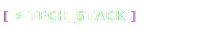

<!-- 
╔══════════════════════════════════════════════════════════════════════════════╗
║                                                                              ║
║   ██████╗ ███████╗██████╗  ██████╗ ██╗   ██╗ █████╗ ███╗   ██╗██╗   ██╗██╗   ║
║   ██╔══██╗██╔════╝██╔══██╗██╔═══██╗╚██╗ ██╔╝██╔══██╗████╗  ██║██║   ██║██║   ║
║   ██████╔╝█████╗  ██║  ██║██║   ██║ ╚████╔╝ ███████║██╔██╗ ██║██║   ██║██║   ║
║   ██╔══██╗██╔══╝  ██║  ██║██║   ██║  ╚██╔╝  ██╔══██║██║╚██╗██║██║   ██║██║   ║
║   ██║  ██║███████╗██████╔╝╚██████╔╝   ██║   ██║  ██║██║ ╚████║╚██████╔╝███████╗
║   ╚═╝  ╚═╝╚══════╝╚═════╝  ╚═════╝    ╚═╝   ╚═╝  ╚═╝╚═╝  ╚═══╝ ╚═════╝ ╚══════╝
║                                                                              ║
║           🚀 AI BACKEND • SYSTEMS ENGINEER • PIPELINE ARCHITECT 🚀           ║
║                                                                              ║
╚══════════════════════════════════════════════════════════════════════════════╝
-->

<div align="center">
  
  <!-- ═══════════════════════════════════════════════════════════════════════════ -->
  <!-- 🎯 ANIMATED HEADER                                                          -->
  <!-- ═══════════════════════════════════════════════════════════════════════════ -->
  
  
  
  <br/>
  
  <!-- ═══════════════════════════════════════════════════════════════════════════ -->
  <!-- 📊 PROFILE BADGES                                                           -->
  <!-- ═══════════════════════════════════════════════════════════════════════════ -->
  
  <a href="https://github.com/sid0803">
    
  </a>
  &nbsp;
  <a href="https://github.com/sid0803?tab=repositories">
    
  </a>
  &nbsp;
  <a href="https://github.com/sid0803?tab=followers">
    
  </a>
  &nbsp;
  <a href="https://github.com/sid0803">
    
  </a>
  
</div>

<br/>

<!-- ═══════════════════════════════════════════════════════════════════════════ -->
<!-- 🖥️ TERMINAL INTRO SECTION                                                   -->
<!-- ═══════════════════════════════════════════════════════════════════════════ -->

<div align="center">
  
</div>

<br/>


<br/>

<!-- ═══════════════════════════════════════════════════════════════════════════ -->
<!-- 👤 ABOUT ME SECTION                                                          -->
<!-- ═══════════════════════════════════════════════════════════════════════════ -->


<br/><br/>

<table>
<tr>
<td width="55%" valign="top">

### 🎯 what_i_do.yaml

```yaml
name: Sandipan Chakraborty
located_in: Kolkata, India 🇮🇳
current_status: AI Backend & Real-Time Systems Engineer

areas_of_expertise:
  - 🤖 AI Pipelines & LLMs
  - 🐍 Python & FastAPI
  - 🌐 Distributed Systems
  - 🧠 Vector Databases (FAISS)
  - ⚡ Async Event Infrastructure

currently_building:
  - Production Voice AI Systems
  - Sub-200ms Inference Pipelines
  - Developer Productivity Tools

life_philosophy: "Scale with precision. Solve with intent."
```

</td>
<td width="45%" valign="top">

### 🚀 Current Focus

- 🔬 **Architecting** production voice AI systems
- 🤖 **Optimizing** LLM inference pipelines
- 🧠 **Building** Cloud Cost Knowledge Graphs
- 🌟 **Scaling** event-driven microservices
- 📚 **Refining** low-latency async I/O

<br/>

### 💡 Quick Facts

- ⚡ Passionate about sub-200ms systems
- 🏗️ Heavy focus on Fault-Tolerant design
- 🧠 Deep dive into Vector Databases (FAISS)
- ☕ Powered by Python & distributed logic

</td>
</tr>
</table>

<br/>


<br/>

<!-- ═══════════════════════════════════════════════════════════════════════════ -->
<!-- 🏆 ACHIEVEMENTS SECTION                                                     -->
<!-- ═══════════════════════════════════════════════════════════════════════════ -->


<br/><br/>

<div align="center">
  
  <!-- GitHub Trophies -->
  <a href="https://github.com/ryo-ma/github-profile-trophy">
    
  </a>
  
</div>

<br/>


<br/>

<!-- ═══════════════════════════════════════════════════════════════════════════ -->
<!-- 📊 GITHUB ANALYTICS                                                         -->
<!-- ═══════════════════════════════════════════════════════════════════════════ -->


<br/><br/>

<div align="center">
  
  <!-- GitHub Stats + Custom Streak in ONE ROW -->
  <a href="https://github.com/sid0803">
    
  </a>
  &nbsp;
  <a href="https://github.com/sid0803">
    
  </a>
  
  <br/><br/>
  
  <!-- 📊 REAL-TIME LANGUAGE USAGE WITH PROGRESS BARS -->
  <a href="https://github.com/sid0803">
    
  </a>
  
  <br/><br/>
  
  <!-- Activity Graph -->
  <a href="https://github.com/sid0803">
    
  </a>
  
</div>

<br/>

<!-- PAC-MAN SECTION -->
<div align="center">
  
  <p>👾 Pac-Man eating my contributions!</p>
</div>

<br/>


<br/>

<!-- ═══════════════════════════════════════════════════════════════════════════ -->
<!-- ⚡ TECH STACK                                                               -->
<!-- ═══════════════════════════════════════════════════════════════════════════ -->



<br/><br/>

<div align="center">

<!-- 💻 LANGUAGES & AI -->
<h4>🤖 Languages & AI</h4>
<p>
  <a href="https://www.python.org/" target="_blank"></a>
  <a href="https://isocpp.org/" target="_blank"></a>
  <a href="https://developer.mozilla.org/en-US/docs/Web/JavaScript" target="_blank"></a>
  <a href="https://www.typescriptlang.org/" target="_blank"></a>
</p>

<!-- 🌐 BACKEND & DATABASES -->
<h4>🌐 Backend & Databases</h4>
<p>
  <a href="https://fastapi.tiangolo.com/" target="_blank"></a>
  <a href="https://nodejs.org/" target="_blank"></a>
  <a href="https://www.postgresql.org/" target="_blank"></a>
  <a href="https://www.mongodb.com/" target="_blank"></a>
  <a href="https://redis.io/" target="_blank"></a>
  <a href="https://www.sqlite.org/" target="_blank"></a>
</p>

<!-- 🔧 INFRASTRUCTURE & DEPLOYMENT -->
<h4>🔧 Infrastructure & Tools</h4>
<p>
  <a href="https://aws.amazon.com/" target="_blank"></a>
  <a href="https://www.docker.com/" target="_blank"></a>
  <a href="https://www.linux.org/" target="_blank"></a>
  <a href="https://git-scm.com/" target="_blank"></a>
  <a href="https://code.visualstudio.com/" target="_blank"></a>
  <a href="https://vercel.com/" target="_blank"></a>
</p>

</div>

<br/>


<br/>

<!-- ═══════════════════════════════════════════════════════════════════════════ -->
<!-- 🔥 CURRENTLY WORKING ON                                                     -->
<!-- ═══════════════════════════════════════════════════════════════════════════ -->

<div align="center">
  
### ⚡ Currently Building & Learning

<br/>

<a href="https://github.com/sid0803">
  
</a>
&nbsp;
<a href="https://github.com/sid0803">
  
</a>
&nbsp;
<a href="https://github.com/sid0803">
  
</a>

</div>

<br/>


<br/>

<!-- ═══════════════════════════════════════════════════════════════════════════ -->
<!-- 🌐 CONNECT WITH ME                                                          -->
<!-- ═══════════════════════════════════════════════════════════════════════════ -->


<br/><br/>

<div align="center">
  
<a href="https://github.com/sid0803" target="_blank">
  
</a>
&nbsp;
<a href="https://linkedin.com/in/sandipan-chakraborty-" target="_blank">
  
</a>
&nbsp;
<a href="mailto:chakrabortysandipan133@gmail.com">
  
</a>
&nbsp;
<a href="https://portfolio-chi-pink-13.vercel.app" target="_blank">
  
</a>

</div>

<br/>

<!-- ═══════════════════════════════════════════════════════════════════════════ -->
<!-- 🌟 FOOTER                                                                   -->
<!-- ═══════════════════════════════════════════════════════════════════════════ -->

<div align="center">
  
  
  
</div>

<!-- ═══════════════════════════════════════════════════════════════════════════ -->
<!-- 📝 END OF README                                                            -->
<!-- ═══════════════════════════════════════════════════════════════════════════ -->
